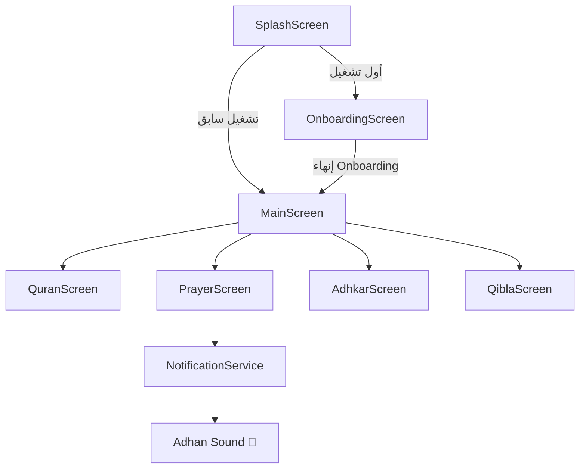

<div align="center">

# 🕌 رفيق المسلم — Muslim Companion

### تطبيق إسلامي متكامل مبني بـ Flutter

[](https://flutter.dev)
[](https://dart.dev)
[](LICENSE)
[](pubspec.yaml)
[](https://flutter.dev)

</div>

---

## 📱 نظرة عامة

**رفيق المسلم** هو تطبيق إسلامي متكامل يجمع بين القرآن الكريم ومواقيت الصلاة والأذان التلقائي والأذكار اليومية واتجاه القبلة في تطبيق واحد احترافي، مبني بأحدث معايير Flutter وBLoC.

---

## ✨ الميزات الرئيسية

### 📖 القرآن الكريم
- عرض القرآن كاملاً بالرسم العثماني المطابق لمصحف المدينة المنورة
- التفسير الميسّر لكل آية بلمسة واحدة
- **حفظ تلقائي لتقدم القراءة** — يعيدك لآخر صفحة توقفت عندها
- تصفح سلس بين الصفحات مع رقم السورة والآية

### 🕰️ مواقيت الصلاة
- مواقيت الصلاة الخمس بدقة عالية وفق **طريقة أم القرى**
- تحديد الموقع الجغرافي التلقائي عبر GPS
- **عداد تنازلي حي** يعرض الوقت المتبقي لكل صلاة قادمة
- بطاقة تفاعلية ذهبية تُبرز الصلاة الحالية
- لا يعرض وقت الشروق كصلاة (يتخطاه مباشرة للظهر)

### 🔔 الأذان التلقائي
- جدولة أذان كل صلاة لمدة **30 يوماً مسبقاً** عبر `flutter_local_notifications`
- يعمل حتى عند إغلاق التطبيق أو إعادة تشغيل الهاتف
- صوت أذان مخصص (`adhan.mp3`) مسجّل في قناة إشعار مستقلة
- **إعادة جدولة تلقائية** عند `BOOT_COMPLETED`
- يعمل على Android 8.0+ مع `Notification Channel` مخصص

### 🌿 الأذكار اليومية
- أذكار الصباح والمساء وأذكار النوم والاستيقاظ
- عداد تكرار لكل ذكر مع تصفير تلقائي يومي

### 🧭 اتجاه القبلة
- بوصلة ذكية برسم `CustomPainter` شفاف بالكامل
- **معادلة صحيحة** مستخرجة من مصدر مكتبة `flutter_qiblah`:
  - إطار البوصلة: `direction × -1`
  - مؤشر مكة: `(offset - direction)`
- خوارزمية **Low-Pass Filter** لحركة سلسة بدون ارتجاف
- فحص مستشعر الهاتف (Magnetometer) قبل التشغيل
- دعم كامل لصلاحيات الموقع مع زر فتح الإعدادات

---

## 🏗️ هيكل المشروع

```
lib/
├── core/
│   ├── services/
│   │   └── notification_service.dart  ← خدمة الأذان
│   ├── theme/
│   │   └── app_colors.dart            ← ألوان التطبيق
│   └── utils/
│       └── permission_manager.dart    ← إدارة الصلاحيات
│
├── features/
│   ├── splash/                        ← شاشة البداية
│   ├── onboarding/                    ← شاشة الترحيب (5 صفحات)
│   ├── main_navigation/               ← شاشة التنقل الرئيسية
│   ├── quran/                         ← قسم القرآن
│   │   ├── data/                      ← QuranDatabaseHelper (SQLite)
│   │   ├── domain/                    ← AyahModel
│   │   └── presentation/
│   │       ├── manager/               ← QuranCubit + QuranState
│   │       └── pages/                 ← QuranScreen + QuranReadingScreen
│   ├── prayer_times/                  ← قسم الصلاة
│   │   └── presentation/
│   │       ├── manager/               ← PrayerCubit + PrayerState
│   │       └── prayer_screen.dart
│   ├── adhkar/                        ← قسم الأذكار
│   ├── qibla/                         ← قسم القبلة
│   │   └── presentation/
│   │       ├── manager/               ← QiblaCubit + QiblaState
│   │       └── pages/qibla_screen.dart
│   └── onboarding/
│       └── presentation/
│           └── onboarding_screen.dart
│
└── main.dart                          ← نقطة البداية
```

---

## 🛠️ التقنيات والمكتبات

| المكتبة | الغرض | الإصدار |
|---------|--------|---------|
| `flutter_bloc` | إدارة الحالة (BLoC/Cubit) | ^9.1.1 |
| `adhan` | حساب مواقيت الصلاة | ^2.0.0+1 |
| `flutter_local_notifications` | إشعارات الأذان | ^21.0.0 |
| `flutter_qiblah` | اتجاه القبلة | ^3.2.0 |
| `geolocator` | الموقع الجغرافي | ^14.0.2 |
| `sqflite` | قاعدة بيانات القرآن | ^2.4.2+1 |
| `quran` | بيانات القرآن | ^1.4.1 |
| `shared_preferences` | تخزين التفضيلات | ^2.5.5 |
| `permission_handler` | إدارة الصلاحيات | ^12.0.1 |
| `smooth_page_indicator` | مؤشر صفحات Onboarding | ^2.0.1 |
| `equatable` | مقارنة الحالات | ^2.0.8 |
| `intl` | تنسيق التاريخ والوقت | ^0.20.2 |
| `timezone` | المناطق الزمنية | ^0.11.0 |

---

## 🎨 نظام التصميم

```dart
class AppColors {
  static const Color background   = Color(0xFF0A0F24); // أزرق داكن عميق
  static const Color cards        = Color(0xFF1C2641); // أزرق رمادي
  static const Color primary      = Color(0xFFD4AF37); // ذهبي مميز
  static const Color textPrimary  = Color(0xFFFFFFFF); // أبيض
  static const Color textSecondary = Color(0xFFA0AABF); // رمادي فاتح
}
```

- خط **Uthmanic** لعرض النصوص العربية والقرآن الكريم
- تصميم Glassmorphism مع تأثيرات ذهبية متدرجة
- أنيميشنات سلسة في جميع الانتقالات

---

## 🚀 تشغيل المشروع

### المتطلبات
- Flutter SDK `>=3.11.5`
- Android SDK `>=21` (Android 5.0 Lollipop)
- Java 17+

### خطوات التثبيت

```bash
# 1. استنساخ المشروع
git clone https://github.com/OmarCodes/islamic_app.git
cd islamic_app

# 2. تثبيت المكتبات
flutter pub get

# 3. تشغيل التطبيق
flutter run
```

### بناء نسخة الإصدار (APK)

```bash
# بناء APK للنشر
flutter build apk --release

# بناء App Bundle للـ Play Store
flutter build appbundle --release
```

---

## 📋 صلاحيات Android المطلوبة

| الصلاحية | الغرض |
|----------|--------|
| `ACCESS_FINE_LOCATION` | تحديد الموقع لحساب مواقيت الصلاة والقبلة |
| `ACCESS_COARSE_LOCATION` | تحديد الموقع التقريبي |
| `POST_NOTIFICATIONS` | إشعارات الأذان (Android 13+) |
| `SCHEDULE_EXACT_ALARM` | جدولة الأذان في الوقت المحدد بدقة |
| `USE_EXACT_ALARM` | استخدام المنبه الدقيق |
| `RECEIVE_BOOT_COMPLETED` | إعادة جدولة الأذان بعد إعادة التشغيل |
| `WAKE_LOCK` | إيقاظ الهاتف لإطلاق الأذان |
| `VIBRATE` | اهتزاز الهاتف مع الأذان |

---

## 📁 الأصول المطلوبة

```
assets/
├── databases/
│   └── quran.db              ← قاعدة بيانات القرآن الكريم (SQLite)
├── fonts/
│   └── uthmanic.ttf          ← خط الرسم العثماني
├── images/
│   ├── icon.png              ← أيقونة التطبيق
│   ├── compass_frame.png     ← إطار البوصلة (غير مستخدم - يرسم بـ CustomPainter)
│   └── qibla_pointer.png     ← مؤشر القبلة (غير مستخدم - يرسم بـ CustomPainter)
└── raw/
    └── adhan.mp3             ← صوت الأذان المخصص
```

> ⚠️ **ملاحظة:** ملف `quran.db` وملف `adhan.mp3` يجب إضافتهما يدوياً.
> - `quran.db` يُوضع في `assets/databases/`
> - `adhan.mp3` يُوضع في `android/app/src/main/res/raw/`

---

## 🔄 سير العمل في التطبيق



---

## 🐛 المشاكل المحلولة

| المشكلة | الحل |
|---------|------|
| صوت الأذان لا يعمل | إنشاء `NotificationChannel` بمعرف `adhan_audio_channel_v2` مع `RawResourceAndroidNotificationSound` |
| البوصلة تشير لاتجاه خاطئ | استخدام المعادلة الرسمية من مصدر المكتبة: `(offset - direction)` للمؤشر |
| عداد الصلاة يتوقف | تحويله لـ `StatefulWidget` مع `Timer.periodic` يستدعي `fetchPrayerTimesData()` |
| تقدم قراءة القرآن لا يُحفظ | `emit` حالة `QuranLoaded` داخل `saveBookmark()` + تهيئة `loadBookmark()` في `main.dart` |
| البوصلة ترتجف | Low-Pass Filter مع معالجة القفز الزاوي (359° → 1°) |
| شاشة الشروق تظهر كصلاة | تخطي `Prayer.sunrise` في دالة `_getNextObligatoryPrayer()` |

---

## 👤 المطوّر

<div align="center">

**المهندس / عمر**

[](https://github.com/OmarCodes)

Omar Codes © 2026 — جميع الحقوق محفوظة

*"وَاللَّهُ يَعْلَمُ وَأَنتُمْ لَا تَعْلَمُونَ"*

</div>
